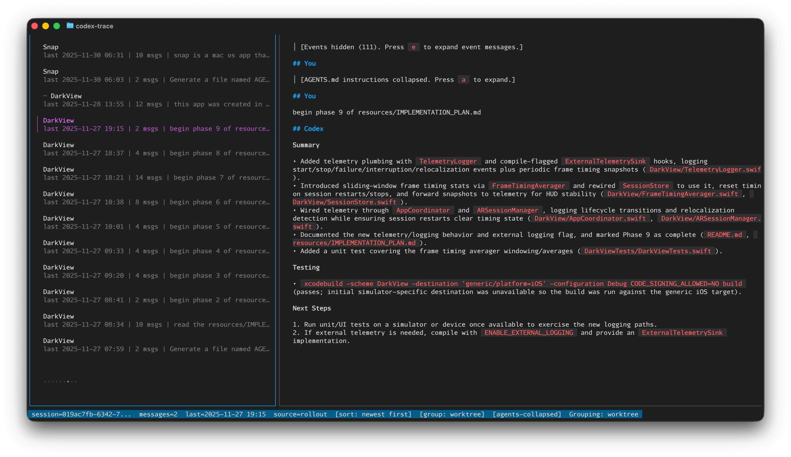

# agent-trace

`agent-trace` is a terminal UI for browsing local Codex & Claude session histories and exporting transcripts to Markdown.

<p align="center">
  <a href="agent-trace.png">
    
  </a>
</p>

## Implementation

The original MVP for this app was created via Codex 5.3: `execute SPECS.md`. Claude support was introduced via Claude Opus 4.6.


## Features

- Left pane sessions list, right pane transcript viewer.
- SQLite index with FTS5 search.
- Markdown export to `docs/<agent>/<session-id>.md` (or `--export-dir`).
- Search match highlighting in transcript view, with `n`/`p` match navigation.
- Clipboard PR snippet copy (`c`) with macOS/Linux clipboard tool detection.
- Transcript toggles for tool output (`t`) and aborted user inputs (`a`).

## Run

```bash
go run ./cmd/agent-trace
```

If your local SQLite build does not include FTS5, the app now falls back to non-FTS search automatically.
To force full FTS5 search with `go-sqlite3`, run:

```bash
go run --tags sqlite_fts5 ./cmd/agent-trace --reindex
```

## Make Targets

```bash
make install   # build and install to ~/.local/bin/agent-trace
make reindex   # run installed binary with --reindex
make rebuild   # install + reindex in one command
```

Flags:

- `--codex-home` override `CODEX_HOME` (default: env `CODEX_HOME` or `$HOME/.codex`)
- `--db-path` SQLite DB path (default: `$CODEX_HOME/codex-history-index.sqlite`)
- `--reindex` force DB rebuild
- `--export-dir` override export output directory

## Keybindings

- `up/down` or `j/k`: move in session list (when list is focused)
- `left` / `right`: focus list / focus transcript
- `tab`: toggle focus between list and transcript
- `enter`: toggle sort order (`newest first` <-> `oldest first`) and reset to top
- `w`: toggle worktree grouping on/off while preserving selected session when possible
- `n`: next search match (or page down when no active search query)
- `p`: previous search match (or page up when no active search query)
- `a`: collapse/expand initial AGENTS.md instructions block in transcript view
- `/`: enter search mode
- `esc`: clear search mode and query
- `?`: toggle centered keyboard-shortcuts modal
- `x`: export selected session
- `c`: export + copy PR snippet to clipboard
- `t`: toggle include tool events
- `u`: toggle include aborted user inputs (`user_message` fallback)
- `e`: toggle include non-message events
- `q`: quit

## Notes

- Works fully offline and reads only local files.
- Malformed JSONL lines are skipped safely.
- Transcript rendering is cached by session + toggles + width to avoid rerender flicker.
- Highlighting is applied after Glamour rendering to preserve markdown styling.
- The bottom row is reserved for status/search info; shortcuts are shown via `?` as a centered modal.
- `enter` toggles newest/oldest sorting and `w` toggles grouping; while searching, results stay relevance-ranked.
- In grouped mode, the first item of each new worktree group is marked with a subtle divider glyph.
- Grouping by worktree is available via `w` and starts disabled by default.
- In grouped mode, worktree groups are ordered by activity recency (not alphabetically).
- If you see no sessions after upgrading, run once with `--reindex` to rebuild offsets/state.
- Very large embedded image payloads are condensed in the TUI display to keep navigation responsive (exports still use full indexed content).
